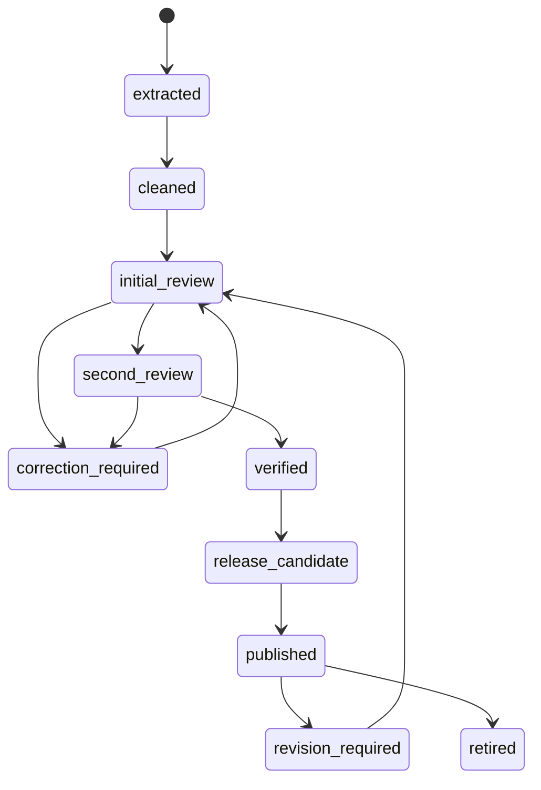

# 文本处理与语料库构建技术规范

**Document ID:** CORPUS-SPEC-01
**Version:** V1.0
**Parent document:** `Marx_Engels_Text_Retrieval_Assistant_Technical_Design_V1.1.md`
**Scope:** 《马克思恩格斯文集》全十卷

---

## 1. 目标与边界

本文规定从原始 PDF 到可发布证据段的完整离线流程，使语料开发者、校验人员、后端开发者和检索开发者使用相同的数据定义。

本流程的最终产物不是“提取出来的一批文本”，而是具备稳定 ID、版本、著作、章节、时间、页码、校验记录和发布状态的证据语料。

### 1.1 必须实现

- 登记《马克思恩格斯文集》十卷的来源、版本、文件哈希和授权状态。
- 保存 Raw、Clean、Verified 三层文本。
- 识别卷、著作、章节、正文段落及其顺序。
- 建立印刷页与 PDF 页的映射。
- 为每个可引用段落生成稳定 `evidence_id`。
- 完成人工初校、复校、发布和可追溯修订。
- 向 SQLite 输出权威数据，并向索引构建器发送发布事件。

### 1.2 不在本文范围

- 在线检索排序和向量聚类。
- 前端证据卡和 PDF 阅读器实现。
- 具体嵌入模型、重排模型和生成模型选择。
- 未经授权语料的对外展示策略。

---

## 2. 核心原则

1. **原始材料不可覆盖**：PDF、页图和 OCR 原始输出只追加、不原地修改。
2. **清洗不等于核验**：自动清洗文本不能直接成为正式引文。
3. **结构优先于固定长度**：先识别著作和章节边界，再确定段落；不得仅按字符数硬切。
4. **页面关系可追溯**：任何 `verified_text` 都必须能定位到至少一个 PDF 页和印刷页。
5. **ID 与内容分离**：正文修订不应随意更换 `evidence_id`；结构发生实质变化时按规则生成新 ID。
6. **发布是显式动作**：只有同时通过文字、元数据和页码复核的数据才能进入正式版本。
7. **未来语料可复用**：导入规则放在语料包内，不把《文集》特例写入通用处理代码。

---

## 3. 目录与语料包

推荐目录：

```text
data/
  corpora/
    marx_engels_collected_works_cn/
      manifest.yaml
      source/
        volume_01/
          original.pdf
          source_record.yaml
        ...
        volume_10/
      raw/
        text/
        page_images/
        ocr/
      clean/
        pages/
        structures/
      verified/
        releases/
      reports/
        extraction/
        verification/
        publication/
      rules/
        headers.yaml
        structure.yaml
        character_map.yaml
```

运行时数据目录与代码目录必须分离。禁止把正式 PDF、SQLite 数据库或 LanceDB 数据文件提交到公共代码仓库。

### 3.1 `manifest.yaml`

```yaml
schema_version: 1
corpus_id: marx_engels_collected_works_cn
display_name: 马克思恩格斯文集
language: zh-CN
edition_id: people_press_2009_cn
publisher: 人民出版社
publish_year: 2009
volume_count: 10
rights_status: pending_review
release_status: draft
```

字段规则：

- `corpus_id`、`edition_id` 使用小写英文、数字和下划线，发布后不可修改。
- `display_name` 只用于展示，不能作为外键或目录判断条件。
- `rights_status` 合法值为 `pending_review / approved / restricted / rejected`。
- `release_status` 合法值为 `draft / validating / published / retired`。

### 3.2 单卷来源记录

```yaml
volume_id: mecw_cn_2009_v01
volume_no: 1
source_type: pdf
source_uri: internal://corpus/mecw/v01
file_name: original.pdf
sha256: "..."
pdf_page_count: 0
printed_page_start: null
printed_page_end: null
acquired_at: "2026-08-24T00:00:00+08:00"
rights_note: "待版权台账确认"
```

`source_uri` 不得包含本机用户名、临时目录或会过期的下载地址。

---

## 4. 标识符规范

### 4.1 稳定 ID

| 对象 | 示例 | 生成规则 |
|---|---|---|
| Corpus | `marx_engels_collected_works_cn` | 人工登记，发布后不可改 |
| Edition | `people_press_2009_cn` | 出版者、年份、语言的稳定组合 |
| Volume | `mecw_cn_2009_v01` | Edition 简码加两位卷号 |
| Work | `work_<uuid>` | 首次登记时生成 UUID，不由题名计算 |
| Section | `sec_<uuid>` | 首次确认结构时生成 UUID |
| Passage | `ev_<uuid>` | 首次形成证据段时生成 UUID |
| Page | `page_<uuid>` | 单卷单 PDF 页面记录 |

### 4.2 ID 保留与更换

- 纠正错别字、标点或页码映射：保留 `evidence_id`，新增修订记录并更新 `text_hash`。
- 一个 passage 被拆为两个：原 ID 标记 `superseded`，两个新段生成新 ID，并记录 `supersedes_id`。
- 两个 passage 合并：原 ID 均标记 `superseded`，合并段生成新 ID。
- passage 移到正确章节但正文和段落边界未变：保留 ID，记录结构修订。
- 删除误识别的页眉、目录或非正文：原 ID 标记 `rejected`，不得物理删除审计记录。

---

## 5. 三层文本模型

### 5.1 Raw 层

保存：

- 原始 PDF 及 SHA-256。
- 每页原始提取文本。
- OCR 输出、置信度、OCR 引擎及版本。
- 页面图像和图像尺寸。
- 提取任务日志、失败页和警告。

Raw 文件以卷和 PDF 页号组织，不得手工修改。需要重跑时创建新的 `extraction_run_id`。

### 5.2 Clean 层

允许自动处理：

- Unicode 规范化。
- 合理的断行合并。
- 页眉、页脚、页码候选标记。
- 著作题名、章节题名、正文和注释候选分类。
- 跨页段落候选连接。
- OCR 低置信字符和异常字符标记。

Clean 层必须保留每次自动变换的规则名和输入位置，不能只保存处理后的纯文本。

### 5.3 Verified 层

Verified 层保存人工确认的：

- `verified_text`
- 语料、版本、卷次、著作和章节关系
- 作者
- 写作时间、发表时间及日期精度
- 印刷页、PDF 页及跨页范围
- 段落顺序和前后段关系
- 初校、复校人员与时间
- 内容哈希和修订版本

只有 Verified 层可作为用户看到的正式引文。

---

## 6. 文本抽取与 OCR

### 6.1 抽取策略

1. 检测 PDF 是否存在可靠文本层。
2. 随机抽检正文页、脚注页、目录页和复杂排版页。
3. 文本层可靠时优先直接提取；扫描页或乱码页进入 OCR。
4. 同一卷允许混合使用直接提取和 OCR，但每页必须记录 `extraction_method`。
5. 任何抽取器输出都不能直接进入 Verified 层。

### 6.2 页面级输出

```json
{
  "extraction_run_id": "run_...",
  "volume_id": "mecw_cn_2009_v01",
  "pdf_page": 25,
  "method": "pdf_text",
  "tool": "adapter_name",
  "tool_version": "x.y.z",
  "raw_text": "...",
  "confidence": null,
  "warnings": []
}
```

### 6.3 OCR 质量门

- OCR 页必须保存页图，不得只保留文本。
- 低置信字符位置要进入校验界面。
- 连续乱码、字符缺失、版面栏序错误的页面标记为 `manual_required`。
- OCR 结果不能利用语言模型“自动补成”原文；模型可提示疑点，但最终修订必须由校验人员对照页面确认。

---

## 7. 清洗规则

### 7.1 Unicode 与空白

- 内部统一使用 UTF-8。
- 建议采用 NFC 规范化；具体实现写入 `normalization_version`。
- 普通正文中的多余换行可合并，但段落边界、诗行、公式和列表结构必须保留。
- 全角/半角、繁简体和异体字不得在 `verified_text` 中自动替换。
- 为检索创建的规范化字段必须与 `verified_text` 分开。

### 7.2 断行与连段

只有同时满足以下条件时，自动连接相邻行：

- 前一行不是明确的段落终止。
- 后一行不是题名、列表、脚注或新段落。
- 两行属于同一 PDF 页面区域或已确认的跨页连续段。

自动连接规则输出 `confidence`。低于配置阈值的记录进入人工确认队列。

### 7.3 页眉、页脚和页码

- 基于同卷多页重复位置和重复文本识别候选。
- 自动规则只做“候选排除”，不得直接从 Raw 层删除。
- 人名、著作名若同时出现在正文，不得因重复而全局删除。
- 印刷页码作为结构字段保存，不保留在正文段落中；正文确实引用页码时除外。

### 7.4 注释与编者文字

每段必须带 `content_type`：

- `main_text`：马恩原著正文，可进入正式检索。
- `author_note`：作者本人注释，可检索，但界面明确标注。
- `editor_note`：编者说明或版本说明，默认不作为“马恩原文”结果。
- `footnote`：脚注，须进一步标记作者属性。
- `toc / header / footer / index`：不进入正式证据索引。

默认四条管线仅检索 `main_text` 和已确认的 `author_note`。用户需要检索编者材料时应使用独立范围选项，不能混入马恩原文。

---

## 8. 结构识别

### 8.1 层级

```text
Corpus > Edition > Volume > Work > Section > Passage
```

任何 passage 只能属于一个 section；section 可以通过 `parent_id` 构成多级章节。

### 8.2 著作边界

著作起止位置至少由以下两项交叉确认：

- 目录记录。
- 正文题名页或题名行。
- 作者和写作/发表说明。
- 上一著作结束标识。
- 人工核验。

禁止依靠“空白页”或固定页数单独判断著作边界。

### 8.3 段落边界

优先遵循原书版式中的自然段。仅在下列场景建立检索辅助分片：

- 单个自然段过长，影响嵌入和重排。
- 表格、列表或连续引文需要单独编码。
- 跨页结构导致抽取器无法稳定恢复段落。

检索辅助分片不得替代原始 passage。建议用独立 `retrieval_unit_id` 指向同一 `evidence_id`，最终展示仍回填完整的 `verified_text`。

### 8.4 前后文关系

- `prev_id` 和 `next_id` 只在同一著作内连接。
- 默认不跨 section 展开；确有连续关系时可由结构字段允许。
- 卷末和著作末不得连接到下一著作。
- 相邻关系必须通过顺序完整性检查，避免环和断链。

---

## 9. 页码映射

### 9.1 页面字段

| 字段 | 含义 |
|---|---|
| `pdf_page` | 从 1 开始的 PDF 物理页序号 |
| `printed_page_label` | 页面印刷标识，允许罗马数字、附页等 |
| `printed_page_number` | 可排序的整数页码；无法转换时为空 |
| `page_type` | `cover / toc / main / appendix / blank` |
| `mapping_status` | `candidate / verified / disputed` |

不得用一个固定偏移量永久替代逐页映射；固定偏移只可用于生成候选。

### 9.2 跨页段落

`passage_page` 保存一对多关系：

```json
[
  {"evidence_id": "ev_...", "pdf_page": 100, "printed_page_label": "95", "order_no": 1},
  {"evidence_id": "ev_...", "pdf_page": 101, "printed_page_label": "96", "order_no": 2}
]
```

界面默认跳转段落起始页，同时展示完整页范围。

---

## 10. 作者与日期规范

### 10.1 作者

作者关系使用结构化枚举：`marx / engels / coauthored / attributed / unknown`，展示名称单独处理。编者或译者不能进入原著作者字段。

### 10.2 日期

每部著作分别保存：

- `work_date_start`
- `work_date_end`
- `date_precision`: `day / month / year / range / approximate / disputed / unknown`
- `date_source`
- `first_publication_date`（如有）

时间序列检索优先使用写作时间。`approximate` 和 `disputed` 必须保留原始说明，不能转换成虚假的精确日期。

---

## 11. 校验工作流

### 11.1 状态机



### 11.2 角色分离

- 初校员：对照 PDF 修订文字、结构和页码。
- 复校员：不得与初校员为同一次操作身份；确认关键字段。
- 发布者：检查批次报告并发布数据快照。
- 管理员：维护语料包和权限，不得跳过校验状态直接发布。

### 11.3 修订记录

每次修订至少记录：

```json
{
  "target_id": "ev_...",
  "field": "verified_text",
  "before_hash": "...",
  "after_hash": "...",
  "reason_code": "ocr_error",
  "comment": "对照 PDF 原页修正",
  "operator": "reviewer_id",
  "created_at": "..."
}
```

禁止只保存最新值而丢失修订原因。

---

## 12. 发布交接

### 12.1 发布前检查

- 十卷来源登记和文件哈希完整。
- 所有正式 passage 均为 `verification_status=verified`。
- 正式 passage 的 `release_status` 将在本批次设置为 `published`。
- 著作、章节和段落顺序无孤儿记录。
- 页码映射达到发布要求。
- `evidence_id` 唯一，`text_hash` 可复算。
- `main_text` 与非原著内容分类通过抽检。
- 修订记录、初校和复校身份完整。

### 12.2 向索引器输出

发布事务写入 `index_outbox`：

```json
{
  "event_id": "evt_...",
  "operation": "upsert",
  "evidence_id": "ev_...",
  "data_version": "data_2026_08_24_001",
  "text_hash": "...",
  "created_at": "..."
}
```

索引器只消费已提交事务中的事件。索引失败不得回滚已核验文本，但对应数据版本不能对外发布为完整可检索版本。

---

## 13. 自动质量检查

每次发布必须运行：

- ID 唯一性与外键检查。
- 著作、章节和 passage 顺序连续性检查。
- `prev_id / next_id` 双向一致性检查。
- 空正文、超短异常段、超长异常段检测。
- 页眉页脚残留、乱码、不可见字符和重复段候选检测。
- 印刷页/PDF 页缺失和倒序检测。
- 作者、日期和 `content_type` 合法值检查。
- 文本哈希与发布清单一致性检查。
- 随机证据回到 PDF 页的抽检样本生成。

自动检查只能发现问题，不能替代人工逐字校验。

---

## 14. 验收标准

| 类别 | 标准 |
|---|---|
| 文件 | 十卷 PDF 均有来源记录和 SHA-256 |
| 文本 | 抽检正式引文与 PDF 原页逐字一致率 100% |
| 元数据 | 作者、著作、版本、卷次抽检正确率 100% |
| 页码 | 正式证据的印刷页和 PDF 页映射抽检正确率 100% |
| 结构 | 无跨著作错误连接，无孤儿 passage，无相邻关系环 |
| 状态 | 未复校数据不能进入 published |
| 可追溯 | 任一 evidence 可追溯到源文件、页面、校验记录和数据版本 |
| 可扩展 | 使用同一流程导入一个小型测试语料包，无需修改通用处理代码 |

---

## 15. 变更规则

- 改变 ID 规则、段落边界原则、内容类型或校验状态机属于破坏性变更，必须升级主版本。
- 增加可选字段或新的自动检查属于次版本变更。
- 规则变化必须记录 `rule_version`，旧数据不得被静默按新规则重写。
- 本文与总体设计冲突时，暂停实现并提交架构决策记录。
