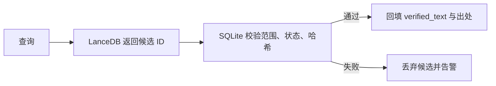

# 数据存储与索引技术规范

**Document ID:** DATA-SPEC-02
**Version:** V1.0
**Parent document:** `Marx_Engels_Text_Retrieval_Assistant_Technical_Design_V1.1.md`
**Related document:** `01_Corpus_Processing_and_Construction_Specification_V1.0.md`

---

## 1. 目标

本文规定 SQLite、SQLite FTS5、LanceDB 和 PDF 文件存储的职责、Schema、同步协议、版本发布、备份恢复和性能边界。

设计结论：

- SQLite 是权威事实真源。
- FTS5 是 SQLite 内部的派生关键词索引。
- LanceDB 是可从 SQLite 重建的向量索引。
- 文件存储保存 PDF、页图和离线处理产物。
- 所有存储通过稳定 `evidence_id` 关联。
- 在线结果必须经过 SQLite 二次校验和原文回填。

---

## 2. 存储布局

```text
runtime-data/
  sqlite/
    corpus.db
  lancedb/
    current/
  assets/
    pdf/
    page-images/
  backups/
  releases/
```

开发、测试和生产环境使用不同根目录，不允许共享可写数据库。路径由配置注入，业务代码不得包含绝对路径。

### 2.1 推荐连接配置

每个 SQLite 连接建立后执行并验证：

```sql
PRAGMA foreign_keys = ON;
PRAGMA journal_mode = WAL;
PRAGMA busy_timeout = 5000;
```

说明：

- `foreign_keys` 必须在每个连接启用。
- WAL 改善读写并发，但不能消除单写者约束。
- `busy_timeout` 的具体值由压测确定，禁止无限重试。
- `synchronous`、`cache_size`、`mmap_size` 等参数属于部署配置，不能未经压测写死为产品逻辑。

---

## 3. SQLite Schema

以下 DDL 是 V1 基线。实际迁移文件必须具有顺序编号，不允许应用启动时临时猜测或修改表结构。

### 3.1 语料层级

```sql
CREATE TABLE corpus (
    corpus_id TEXT PRIMARY KEY,
    name TEXT NOT NULL,
    language TEXT NOT NULL,
    schema_version INTEGER NOT NULL,
    rights_status TEXT NOT NULL,
    release_status TEXT NOT NULL,
    created_at TEXT NOT NULL,
    updated_at TEXT NOT NULL
);

CREATE TABLE edition (
    edition_id TEXT PRIMARY KEY,
    corpus_id TEXT NOT NULL REFERENCES corpus(corpus_id),
    publisher TEXT,
    publish_year INTEGER,
    isbn TEXT,
    edition_label TEXT,
    rights_status TEXT NOT NULL,
    release_status TEXT NOT NULL,
    created_at TEXT NOT NULL,
    updated_at TEXT NOT NULL
);

CREATE TABLE asset (
    asset_id TEXT PRIMARY KEY,
    asset_type TEXT NOT NULL,
    storage_uri TEXT NOT NULL,
    sha256 TEXT NOT NULL UNIQUE,
    byte_size INTEGER NOT NULL,
    mime_type TEXT NOT NULL,
    created_at TEXT NOT NULL
);

CREATE TABLE volume (
    volume_id TEXT PRIMARY KEY,
    edition_id TEXT NOT NULL REFERENCES edition(edition_id),
    volume_no INTEGER NOT NULL,
    title TEXT NOT NULL,
    pdf_asset_id TEXT NOT NULL REFERENCES asset(asset_id),
    release_status TEXT NOT NULL,
    UNIQUE (edition_id, volume_no)
);

CREATE TABLE work (
    work_id TEXT PRIMARY KEY,
    volume_id TEXT NOT NULL REFERENCES volume(volume_id),
    title TEXT NOT NULL,
    author_code TEXT NOT NULL,
    work_date_start TEXT,
    work_date_end TEXT,
    date_precision TEXT NOT NULL,
    date_source TEXT,
    first_publication_date TEXT,
    order_no INTEGER NOT NULL,
    verification_status TEXT NOT NULL,
    release_status TEXT NOT NULL,
    UNIQUE (volume_id, order_no)
);

CREATE TABLE section (
    section_id TEXT PRIMARY KEY,
    work_id TEXT NOT NULL REFERENCES work(work_id),
    parent_id TEXT REFERENCES section(section_id),
    title TEXT,
    level INTEGER NOT NULL,
    order_no INTEGER NOT NULL,
    verification_status TEXT NOT NULL,
    UNIQUE (work_id, parent_id, order_no)
);
```

日期统一保存 ISO 8601 字符串；不完整日期通过 `date_precision` 解释，禁止使用任意占位日制造精确日期。

### 3.2 页面与证据段

```sql
CREATE TABLE page_map (
    page_id TEXT PRIMARY KEY,
    volume_id TEXT NOT NULL REFERENCES volume(volume_id),
    pdf_page INTEGER NOT NULL CHECK (pdf_page >= 1),
    printed_page_label TEXT,
    printed_page_number INTEGER,
    page_type TEXT NOT NULL,
    mapping_status TEXT NOT NULL,
    UNIQUE (volume_id, pdf_page)
);

CREATE TABLE passage (
    evidence_id TEXT PRIMARY KEY,
    section_id TEXT NOT NULL REFERENCES section(section_id),
    content_type TEXT NOT NULL,
    verified_text TEXT NOT NULL CHECK (length(verified_text) > 0),
    text_hash TEXT NOT NULL,
    prev_id TEXT REFERENCES passage(evidence_id),
    next_id TEXT REFERENCES passage(evidence_id),
    order_no INTEGER NOT NULL,
    verification_status TEXT NOT NULL,
    release_status TEXT NOT NULL,
    revision_no INTEGER NOT NULL DEFAULT 1,
    supersedes_id TEXT REFERENCES passage(evidence_id),
    created_at TEXT NOT NULL,
    updated_at TEXT NOT NULL,
    UNIQUE (section_id, order_no)
);

CREATE TABLE passage_page (
    evidence_id TEXT NOT NULL REFERENCES passage(evidence_id),
    page_id TEXT NOT NULL REFERENCES page_map(page_id),
    order_no INTEGER NOT NULL,
    start_offset INTEGER,
    end_offset INTEGER,
    PRIMARY KEY (evidence_id, page_id)
);
```

`start_offset / end_offset` 仅在坐标或页内字符位置可靠时写入；不能为了满足非空约束伪造。

### 3.3 校验、发布与审计

```sql
CREATE TABLE verification_event (
    verification_id TEXT PRIMARY KEY,
    target_type TEXT NOT NULL,
    target_id TEXT NOT NULL,
    field_name TEXT,
    before_hash TEXT,
    after_hash TEXT,
    reason_code TEXT NOT NULL,
    comment TEXT,
    operator_id TEXT NOT NULL,
    action TEXT NOT NULL,
    created_at TEXT NOT NULL
);

CREATE TABLE data_release (
    data_version TEXT PRIMARY KEY,
    corpus_id TEXT NOT NULL REFERENCES corpus(corpus_id),
    passage_count INTEGER NOT NULL,
    manifest_hash TEXT NOT NULL,
    status TEXT NOT NULL,
    created_at TEXT NOT NULL,
    published_at TEXT
);

CREATE TABLE index_outbox (
    event_id TEXT PRIMARY KEY,
    evidence_id TEXT NOT NULL REFERENCES passage(evidence_id),
    operation TEXT NOT NULL,
    data_version TEXT NOT NULL REFERENCES data_release(data_version),
    text_hash TEXT NOT NULL,
    status TEXT NOT NULL DEFAULT 'pending',
    attempt_count INTEGER NOT NULL DEFAULT 0,
    last_error TEXT,
    created_at TEXT NOT NULL,
    processed_at TEXT
);

CREATE TABLE index_release (
    index_version TEXT PRIMARY KEY,
    data_version TEXT NOT NULL REFERENCES data_release(data_version),
    embedding_provider TEXT NOT NULL,
    embedding_model TEXT NOT NULL,
    embedding_dimension INTEGER NOT NULL,
    config_hash TEXT NOT NULL,
    row_count INTEGER NOT NULL,
    status TEXT NOT NULL,
    created_at TEXT NOT NULL,
    published_at TEXT
);

CREATE TABLE search_audit (
    request_id TEXT PRIMARY KEY,
    mode TEXT NOT NULL,
    query_text TEXT NOT NULL,
    scope_json TEXT NOT NULL,
    data_version TEXT NOT NULL,
    index_version TEXT,
    model_versions_json TEXT NOT NULL,
    candidate_trace_json TEXT,
    result_ids_json TEXT NOT NULL,
    warning_codes_json TEXT NOT NULL,
    latency_ms INTEGER NOT NULL,
    created_at TEXT NOT NULL
);
```

`search_audit` 中的查询文本可能具有隐私性。生产部署必须定义保留期、访问权限和可选脱敏策略。

### 3.4 必需索引

```sql
CREATE INDEX idx_edition_corpus ON edition(corpus_id);
CREATE INDEX idx_volume_edition ON volume(edition_id, volume_no);
CREATE INDEX idx_work_volume_order ON work(volume_id, order_no);
CREATE INDEX idx_work_date ON work(work_date_start, work_date_end);
CREATE INDEX idx_section_work_order ON section(work_id, order_no);
CREATE INDEX idx_passage_section_order ON passage(section_id, order_no);
CREATE INDEX idx_passage_release ON passage(release_status, verification_status);
CREATE INDEX idx_page_volume_pdf ON page_map(volume_id, pdf_page);
CREATE INDEX idx_outbox_pending ON index_outbox(status, created_at);
```

索引是否保留以真实查询计划和压测为准，但主键、外键和范围过滤索引不得随意删除。

---

## 4. SQLite 精确检索与 FTS5

### 4.1 权威精确检索

精确检索的最终条件是：

```sql
SELECT p.evidence_id
FROM passage AS p
JOIN section AS s ON s.section_id = p.section_id
JOIN work AS w ON w.work_id = s.work_id
JOIN volume AS v ON v.volume_id = w.volume_id
JOIN edition AS e ON e.edition_id = v.edition_id
WHERE p.verification_status = 'verified'
  AND p.release_status = 'published'
  AND e.corpus_id = :corpus_id
  AND instr(p.verified_text, :query) > 0;
```

所有筛选参数必须绑定，不拼接用户输入。V1 十卷规模下应先测量直接查询性能，再决定是否启用候选加速。

### 4.2 FTS5 表

```sql
CREATE VIRTUAL TABLE passage_fts USING fts5(
    evidence_id UNINDEXED,
    search_text
);
```

实现约束：

- `search_text` 是检索辅助文本，不是正式引文。
- FTS5 主要服务观点、时间、思想结构管线的关键词候选。
- 如使用 trigram tokenizer 加速精确查询，必须验证一至二字查询限制，并用 `INSTR` 结果集做等价性回归。
- FTS 候选无论得分多高，都必须回到 passage 表检查状态和范围。
- FTS 重建使用临时表或新数据文件，验证后再发布，避免在线暴露半成品。

### 4.3 `search_text`

推荐格式：

```text
[文献集合] 马克思恩格斯文集
[卷次] 第一卷
[著作] 关于费尔巴哈的提纲
[章节] ...
[正文] verified_text
```

题名和标签只帮助召回。证据卡不得直接展示整个 `search_text`。

---

## 5. LanceDB Schema

LanceDB 版本必须在依赖锁文件中固定。具体 API 调用以项目锁定版本为准，Schema 语义不得随库升级改变。

### 5.1 逻辑字段

| 字段 | 类型 | 约束 |
|---|---|---|
| `retrieval_unit_id` | string | 主检索单元 ID，唯一 |
| `evidence_id` | string | 必须存在于 SQLite passage |
| `corpus_id` | string | 范围过滤字段 |
| `edition_id` | string | 范围过滤字段 |
| `volume_id` | string | 范围过滤字段 |
| `work_id` | string | 范围过滤字段 |
| `content_type` | string | 默认只允许正式原著内容 |
| `search_text` | string | 检索辅助文本 |
| `vector` | fixed-size float vector | 维度由索引发布记录固定 |
| `text_hash` | string | 对应 SQLite passage 当前哈希 |
| `embedding_provider` | string | 提供商标识 |
| `embedding_model` | string | 模型名和版本 |
| `data_version` | string | SQLite 数据版本 |
| `index_version` | string | 当前索引版本 |
| `release_status` | string | 仅 published 可供在线查询 |

一个 `evidence_id` 可以对应多个 `retrieval_unit_id`，用于长段分片；最终结果按 `evidence_id` 合并和回填。

### 5.2 Schema 定义示例

以下为说明性示例，向量维度从配置读取：

```python
from lancedb.pydantic import LanceModel, Vector

EMBEDDING_DIMENSION = 1024


class PassageVector(LanceModel):
    retrieval_unit_id: str
    evidence_id: str
    corpus_id: str
    edition_id: str
    volume_id: str
    work_id: str
    content_type: str
    search_text: str
    vector: Vector(EMBEDDING_DIMENSION)
    text_hash: str
    embedding_provider: str
    embedding_model: str
    data_version: str
    index_version: str
    release_status: str
```

禁止让 LanceDB 的自动 embedding 功能成为唯一生成路径；本项目需要显式记录模型、输入文本哈希、失败重试和批次版本。

### 5.3 范围过滤

向量查询必须先构造经过白名单验证的过滤条件。用户输入不能直接拼成 LanceDB SQL/filter 字符串。过滤条件至少包含：

- 已发布索引版本。
- `release_status=published`。
- 一个或多个合法 `corpus_id`。
- 可选 edition、volume、work 和 content_type。

范围过滤完成后仍要由 SQLite 二次复核。

---

## 6. 索引构建

### 6.1 全量构建

1. 固定待构建的 `data_version`。
2. 从 SQLite 流式读取已校验、待发布的 passage。
3. 生成 `search_text` 和必要的 retrieval units。
4. 计算输入哈希并批量生成 embedding。
5. 写入新的 LanceDB 表、目录或分支，不修改当前 published 索引。
6. 建立适用的标量/向量索引。
7. 运行数量、哈希、范围、孤儿 ID 和检索 smoke test。
8. 写入 `index_release`。
9. 原子切换应用使用的 `index_version` 配置。
10. 保留上一发布版本，直到新版本稳定通过观察期。

### 6.2 增量构建

索引器按 `index_outbox.created_at, event_id` 顺序消费：

- `upsert`：更新或新增所有对应 retrieval units。
- `delete`：从在线索引移除，但 SQLite 保留历史审计记录。
- `rebuild_work`：重建一部著作的检索单元。
- `rebuild_corpus`：转入全量构建任务。

事件处理必须幂等。只有所有目标记录写入并复核后，事件才标记 `processed`。

### 6.3 Embedding 批处理

- 以 token/字符预算控制批次，不只按记录条数。
- 记录每批模型、维度、输入哈希、开始/结束时间和失败原因。
- 可重试错误采用指数退避和最大次数。
- 输入内容错误、维度变化或权限错误进入失败队列，不无限重试。
- 同一 `text_hash + embedding_model + preprocessing_version` 可复用缓存。

### 6.4 索引优化

LanceDB 的优化、向量索引、标量索引和表版本 API 会随锁定版本变化。实施时必须依据项目固定版本的官方文档编写适配器和集成测试。禁止在业务管线中直接调用版本特定 API。

---

## 7. 双库一致性

### 7.1 在线读取规则



SQLite 复核项：

- `evidence_id` 存在。
- `verification_status=verified`。
- `release_status=published`。
- 属于当前 scope。
- `text_hash` 与索引记录一致。
- 数据版本与本次请求的发布组合兼容。

### 7.2 一致性检查

每次索引发布检查：

- SQLite 发布 passage 数与唯一 evidence 数。
- LanceDB retrieval unit 数与预期分片数。
- LanceDB 中不存在 SQLite 孤儿 ID。
- 每个应索引 passage 至少有一个 retrieval unit。
- 随机或全量比对 `text_hash`。
- 向量维度、模型和配置哈希一致。
- 范围过滤可正确隔离 corpus、volume 和 work。

---

## 8. 事务与并发

- 在线查询使用短事务，不在读取期间调用模型。
- 语料写入和发布由单写者任务执行。
- 大批量导入分批提交，避免长期占用写锁。
- 索引器先读取稳定数据快照，再在 SQLite 外计算 embedding。
- 不在一个 SQLite 事务中等待 LanceDB 或远程模型响应。
- 发生 `SQLITE_BUSY` 时按配置重试，超过上限返回可诊断错误。
- API 进程不得执行 schema migration；迁移是独立部署步骤。

---

## 9. 备份、恢复与重建

### 9.1 SQLite

- 使用 SQLite backup API 或经过验证的在线备份方式，不直接复制正在写入的单个数据库文件。
- 备份后执行 `PRAGMA integrity_check` 或约定的完整性检查。
- 备份文件加时间、数据版本和校验和。
- 定期执行恢复演练；“产生备份文件”不等于可恢复。

### 9.2 LanceDB

- LanceDB 可备份以缩短恢复时间，但不作为唯一恢复来源。
- 必须提供从指定 SQLite `data_version` 全量重建的命令。
- 重建完成后执行第 7.2 节一致性检查。

### 9.3 PDF 和页图

- 原始 PDF 按 SHA-256 去重并使用不可变路径。
- 数据库 `storage_uri` 与实际文件做定期一致性检查。
- 恢复时先恢复 SQLite 和资产清单，再恢复/重建索引。

---

## 10. 配置

示例环境变量名称：

```text
APP_ENV
SQLITE_DATABASE_PATH
SQLITE_BUSY_TIMEOUT_MS
LANCEDB_URI
ACTIVE_DATA_VERSION
ACTIVE_INDEX_VERSION
EMBEDDING_PROVIDER
EMBEDDING_MODEL
EMBEDDING_DIMENSION
PDF_ASSET_ROOT
```

规则：

- 不提供默认生产路径。
- 机密信息不写入 Markdown、代码或数据库审计明文。
- 应用启动时验证 active data/index version 是否存在且为 published。
- 嵌入维度与 LanceDB Schema 不一致时启动失败，不自动截断或填充向量。

---

## 11. 验收标准

| 项目 | 标准 |
|---|---|
| Schema | 迁移可在空库执行，可在上一版本升级，外键检查通过 |
| 精确查询 | 返回结果均通过 `INSTR`；短词无 FTS 漏检 |
| 向量索引 | 模型、维度、哈希和版本完整记录 |
| 双库一致性 | 孤儿 evidence 进入最终结果为 0 |
| 发布 | 半成品索引不会被在线请求读取 |
| 回滚 | 可切回上一组 data/index version |
| 备份 | SQLite 恢复演练通过；LanceDB 可全量重建 |
| 并发 | 目标读写压测下无不可控锁等待，错误可观测 |

---

## 12. 变更规则

- SQLite DDL 只能通过迁移文件修改。
- LanceDB 字段或向量维度变化必须创建新 `index_version`。
- 更换 embedding 模型必须全量构建新索引，不能在同一版本混用向量。
- 改变 `search_text` 生成规则必须更新 `preprocessing_version` 和配置哈希。
- 存储适配器可以替换，`evidence_id`、范围和证据回填契约不得改变。
