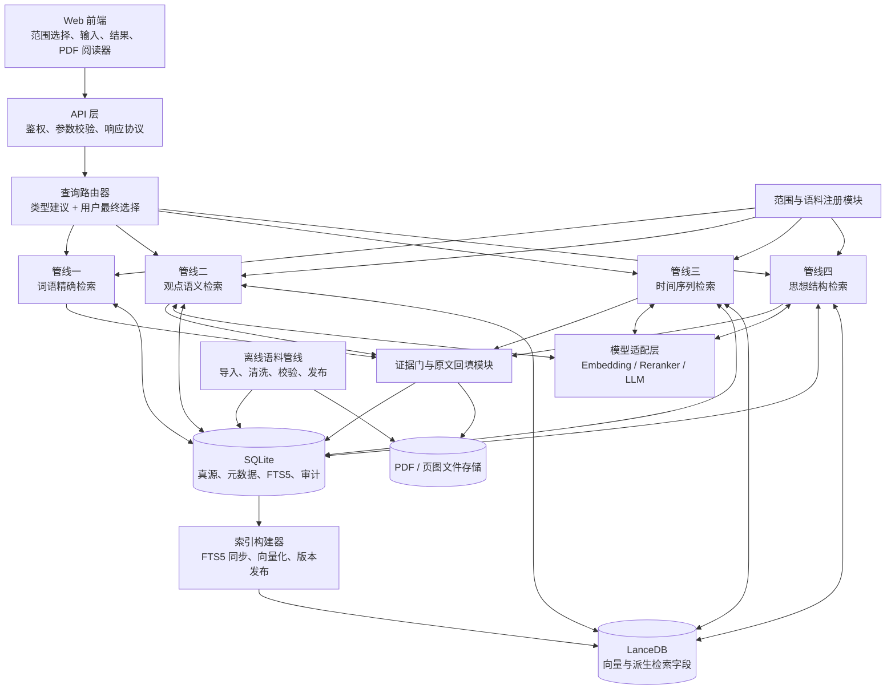
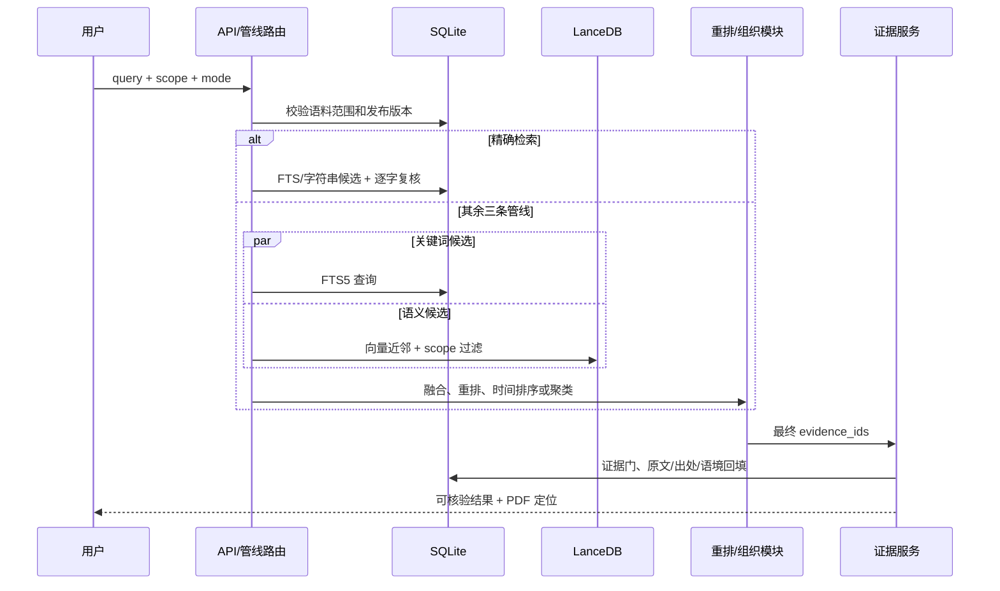

# 马恩文本检索助手产品设计说明书

**版本：V1.1**
**日期：2026 年 8 月 24 日**
**首版语料范围：《马克思恩格斯文集》全十卷**
**产品原则：以经校验的马恩原著为唯一证据源，先检索证据，再组织结果；所有引文均可回到版本、卷次、正文页和 PDF 原页。**

---

## 0. 文档目的与本次修订结论

本文用于统一产品、语料、前端、后端、检索、算法和测试团队的实现边界。V1.1 对原说明书作出三项核心调整：

1. 产品采用模块化、接口化架构，各模块可由不同开发者并行实现和独立测试。
2. 第一版只发布《马克思恩格斯文集》十卷，但数据模型、接口和索引均不得写死书名、卷数或版本，后续可按“语料包”接入《马克思恩格斯全集》等文献集合。
3. 检索明确拆分为四条业务管线；结构化真源和关键词检索使用 SQLite，向量检索使用 LanceDB，两者以稳定的 `evidence_id` 关联，组成可追溯的混合 RAG 架构。

### 0.1 配套细分技术文档

本说明书是最高层设计基线，具体实现以同目录下五份细分规范为准：

1. `01_Corpus_Processing_and_Construction_Specification_V1.0.md`
2. `02_Data_Storage_and_Indexing_Specification_V1.0.md`
3. `03_Retrieval_Pipelines_and_Evidence_Service_Specification_V1.0.md`
4. `04_API_and_Frontend_Integration_Specification_V1.0.md`
5. `05_Testing_Deployment_and_Operations_Specification_V1.0.md`

细分规范不得改变本文确定的产品范围、四条管线、SQLite 真源、LanceDB 派生索引和证据回填原则；如需改变，应先形成架构决策记录并更新本文版本。

### 0.2 第一版产品边界

| 项目 | V1 范围 |
|---|---|
| 正式语料 | 《马克思恩格斯文集》全十卷；正式发布前，十卷均须完成校验、页码映射和索引发布 |
| 查询能力 | 词语精确检索、观点语义检索、问题/领域的时间序列检索、问题/领域的思想结构检索 |
| 结果形态 | 原文证据段、出处、前后语境、印刷页码、PDF 页定位；时间管线和思想结构管线可附受约束的组织说明 |
| 后台能力 | 语料导入、清洗、人工校验、发布、索引构建、索引版本管理、检索日志和评测 |
| 暂不提供 | 《选集》《全集》的正式检索，多用户协作空间，自动知识图谱，复杂代理工作流，模型自由生成“原话” |

> 可扩展性不等于 V1 同时导入所有语料。V1 只交付《文集》十卷，但用同一套语料包协议、数据表和检索接口承载未来新增文献。

### 0.3 四条不可突破的产品红线

| 红线 | 强制规则 |
|---|---|
| 原文唯一 | 引文只能读取 SQLite 中已发布的 `verified_text`；模型不得生成、补写、改写原文。 |
| 范围先行 | 检索前先确定 `corpus_id / edition_id / volume_id / work_id`；任何越界候选必须被过滤。 |
| 证据先行 | 所有归纳、分类和标签必须绑定本次证据池中的 `evidence_id`；没有证据就不输出确定性结论。 |
| 版本可辨 | 同文异版分别保存和展示，不静默合并；引文必须带版本、卷次和页码。 |

---

## 1. 产品定位与用户任务

本产品不是“和 PDF 聊天”，而是面向理论研究、教学备课、引文核验和文本阅读的原典检索工具。用户可以从一个准确词语、一个待求证观点，或一个较宽的问题/领域出发，获得能够回到原书核验的文本证据。

### 1.1 典型用户

| 用户 | 主要任务 | 产品提供的帮助 |
|---|---|---|
| 理论研究者、教师、研究生 | 为观点找原典依据，观察思想发展，核验引文 | 限定语料检索、证据排序/组织、标准出处、PDF 定位 |
| 编辑、资料员 | 查找原词，确认卷次和页码，整理摘录 | 严格字面命中、上下文、可复制出处、纠错反馈 |
| 普通读者 | 从概念或问题进入原著阅读 | 语义相关段落、时间脉络、思想主题分组 |

### 1.2 首页交互原则

首页保留一个主输入框，但必须显式展示“当前语料范围”和“检索方式”。V1 默认范围为《马克思恩格斯文集》十卷中所有已发布内容，用户可继续筛选卷次、作者、著作或时间。

系统可以给出输入类型建议，但不得只靠模型静默决定管线。用户始终可以手动切换：

- 输入被识别为词语：建议“精确检索”。
- 输入被识别为观点/判断句：建议“观点语义检索”。
- 输入被识别为问题或领域：先要求用户选择“按时间呈现”或“按思想结构呈现”，再执行对应管线。
- 识别置信度不足时：保持输入不变，展示四种方式供用户选择。

---

## 2. 四条检索管线

四条管线共享范围过滤、证据门、原文回填、页码定位和审计日志，但其召回方式、排序规则和输出形态不同。不得把四种需求合并成一个不可解释的统一提示词。

### 2.1 管线一：词语精确检索（Exact Search）

**触发条件**：用户输入一个词语、固定短语或明确原句，并选择或接受“精确检索”。

**用户预期**：只看到原文中准确出现该字符串的段落；不得因为同义、近义或语义相关而混入未出现该词的段落。

**处理流程**：

1. 保留用户原始输入，不做同义词扩展、分词扩展或模型改写。
2. 在 SQLite 的已发布范围中直接执行 `INSTR(verified_text, query) > 0`，把它作为 V1 的权威精确检索条件。
3. 可用 FTS5 trigram 先生成候选以加速三字及以上查询，但必须经过 `INSTR` 逐字复核，并用回归测试证明与直接扫描结果等价；一至二字查询直接走 `INSTR`。
4. 删除范围外、未校验、未发布或不能通过逐字校验的候选。
5. 默认按“命中密度 → 卷次 → 正文页码”排序，也允许用户改为卷次/页码顺序。
6. 由 SQLite 回填原文、出处、页码和相邻段落。

**严格规则**：

- 不调用向量召回来补足结果。
- 不自动转换同义词、繁简体、旧译名或词形；这些可作为用户主动开启的“变体检索”，不能标为精确命中。
- 高亮只影响显示，不得改变 `verified_text`。
- 无命中时明确返回“在当前范围内未发现该词的逐字命中”。

**输出**：精确命中的证据卡列表，每张卡显示命中次数、命中位置、原文、作者、著作、卷次、正文页、PDF 页和上下文入口。

### 2.2 管线二：观点语义检索（Claim Search）

**触发条件**：用户输入一个观点、判断或需要原典佐证的陈述，例如“社会存在决定社会意识”。

**用户预期**：按“对该观点的支撑程度”从高到低看到原文段落，而不是只看是否包含相同词语。

**处理流程**：

1. 保存原观点；查询理解模块可抽取主语、谓语、核心概念和否定关系，但不能替换原查询。
2. 用嵌入模型生成查询向量，在 LanceDB 中按当前语料范围召回语义近邻。
3. 可并行从 SQLite FTS5 召回包含核心概念的候选，用 RRF 合并两路候选；语义召回是主通道，关键词召回仅提高覆盖率。
4. 使用可替换的重排器判断“段落是否支撑该观点”，标记为“直接支撑、间接相关、相反/保留意见、不相关”。
5. 过滤不相关项；相反或保留意见可以保留，但必须清楚标记，不能当作佐证材料。
6. 按支撑等级、重排分和语义相似度排序。
7. 只凭 `evidence_id` 从 SQLite 回填正式引文和出处。

**输出**：以证据段为主体的结果列表，显示“直接支撑/间接相关/相反材料”标签、相关度说明和可追溯出处。默认不生成一段替用户下结论的长答案。

### 2.3 管线三：问题/领域的时间序列检索（Timeline Search）

**触发条件**：用户输入某一问题或领域，并选择“按时间顺序呈现”，例如“马克思恩格斯如何看待舆论”。

**用户预期**：只在与问题相关的证据中，按照思想材料形成的时间从早年到晚年排列，从而观察发展、延续或变化。

**处理流程**：

1. 使用“语义召回 + 核心概念关键词召回”建立高召回候选池。
2. 经重排和证据门过滤，先保证候选与问题相关，再进行时间排序；不得把无关段落仅因年代明确而纳入。
3. 时间字段优先使用著作的写作时间，其次使用首次发表时间；版本出版年只用于版本说明，不代表思想形成时间。
4. 对日期区间、约数和不确定日期保留 `date_precision`，不得伪造精确年月日。
5. 按 `work_date_start` 从早到晚排列；同一著作内按章节和正文页排序。
6. 同一时期材料过多时，可按年代或研究设定的阶段折叠，但阶段名称必须说明是界面组织方式。
7. 时间缺失或有争议的材料单列为“时间待考”，不强行插入序列。

**输出**：时间轴/分期列表。每个时间节点包含日期或日期区间、著作、作者、证据卡和 PDF 入口；可附一段机器生成的阶段摘要，但摘要中的每个判断必须绑定证据编号。

### 2.4 管线四：问题/领域的思想结构检索（Thematic Search）

**触发条件**：用户输入某一问题或领域，并选择“按思想结构呈现”，例如“马克思恩格斯的舆论观”。

**用户预期**：相关证据按语义接近程度归为若干主题类，并按类浏览，而不是得到一条混杂的长列表。

**处理流程**：

1. 使用混合召回得到与问题相关的候选，经重排和证据门形成最终证据池。
2. 从 LanceDB 读取候选向量，在本次证据池内执行聚类；V1 可采用凝聚层次聚类，并通过阈值和最小簇大小控制类数。
3. 对明显离群的段落设为“其他相关材料”，不得为追求整齐而强行归类。
4. 允许模型根据簇内证据生成短主题标签和一句话说明，但模型只能读取簇内证据，只能返回 `cluster_label / cluster_summary / evidence_ids`。
5. 后端校验所有 `evidence_ids` 属于本次证据池；原文、作者、著作和页码仍由 SQLite 回填。
6. 类别按与用户问题的聚合相关度排序；类内按支撑度和语义相似度排序。
7. 聚类结果是“本次检索的语义组织”，不是预先断言的权威思想体系，界面必须显示这一提示。

**输出**：若干主题组，每组包含主题名、机器归纳说明和证据卡。用户可切换为“仅看证据”，隐藏所有机器归纳。

### 2.5 四条管线对照

| 管线 | 主要检索源 | 关键排序/组织规则 | 是否允许模型参与 | 结果核心 |
|---|---|---|---|---|
| 词语精确检索 | SQLite / FTS5 | 逐字命中、命中密度、卷页 | 不参与召回和引文 | 准确出现该词的段落 |
| 观点语义检索 | LanceDB，辅以 SQLite FTS5 | 支撑等级、重排分、语义相似度 | 可做支撑判断，不生成引文 | 能佐证或回应观点的段落 |
| 时间序列检索 | SQLite + LanceDB 混合召回 | 相关性门槛后，按写作时间排序 | 可生成绑定证据的阶段摘要 | 从早年到晚年的材料序列 |
| 思想结构检索 | SQLite + LanceDB 混合召回 | 向量聚类，类间/类内相关度 | 可命名主题和归纳，不生成引文 | 按语义相近程度归类的材料 |

---

## 3. 模块化总体架构

### 3.1 架构原则

- **边界清楚**：语料、检索、组织、证据和展示通过接口传递，不直接跨模块读写内部状态。
- **存储可替换**：业务层依赖 `MetadataRepository`、`ExactSearchIndex`、`VectorIndex` 等接口，不在业务代码中散落 SQLite 或 LanceDB 查询语句。
- **四管线独立演进**：每条管线有独立服务类、配置、评测集和指标，共享基础能力但互不绑死。
- **索引可重建**：SQLite 的已校验数据是事实真源；FTS5 和 LanceDB 都是派生索引，损坏或更换模型时可从真源重建。
- **语料可插拔**：新增《全集》应主要表现为新增语料包、导入规则和索引分区，而不是修改四条管线。
- **先做模块化单体**：V1 在一个代码仓库和一个后端进程内保持清晰模块边界，降低部署复杂度；并发和规模增长后再按接口拆成服务。

### 3.2 逻辑架构图



### 3.3 模块清单与责任边界

| 模块 | 责任 | 对外接口 | 可并行开发 |
|---|---|---|---|
| `web-ui` | 输入、范围筛选、管线选择、证据卡、时间轴、主题组、PDF 阅读 | REST/JSON 响应协议 | 可用 mock API 独立开发 |
| `api` | 参数校验、错误码、分页、请求追踪、响应封装 | `/api/v1/search` 等 | 可依据 OpenAPI 契约开发 |
| `query-router` | 输入类型建议、接受用户最终模式、不修改原查询 | `suggest_mode(query)` | 可用标注样本独立测试 |
| `corpus-registry` | 语料包、版本、卷次、著作、发布时间和范围校验 | `resolve_scope(scope)` | 与检索管线并行 |
| `exact-pipeline` | 逐字召回和最终精确校验 | `search_exact(request)` | 独立题集、无需模型 |
| `claim-pipeline` | 语义召回、混合融合、支撑判断与排序 | `search_claim(request)` | 依赖抽象索引接口 |
| `timeline-pipeline` | 相关证据召回、时间字段处理和排序 | `search_timeline(request)` | 可用固定候选集开发 |
| `thematic-pipeline` | 相关证据召回、聚类、主题命名和类内排序 | `search_thematic(request)` | 可用固定向量样本开发 |
| `retrieval-core` | FTS、向量查询、RRF、去重、重排、MMR 等共享算法 | 标准 `Candidate[]` | 为四管线提供库，不含 UI 逻辑 |
| `evidence-service` | verified 过滤、范围复核、原文/出处回填、上下文、PDF 定位 | `hydrate(evidence_ids)` | 可围绕 SQLite 独立开发 |
| `model-adapters` | Embedding、Reranker、LLM 的统一协议、超时和版本记录 | Provider interfaces | 可替换本地或远程模型 |
| `ingestion` | PDF 登记、抽取、清洗、结构识别、人工校验、发布 | 导入任务协议 | 与在线检索并行 |
| `indexer` | FTS5 和 LanceDB 增量/全量构建、校验、发布、回滚 | 索引任务协议 | 与语料校验界面并行 |
| `evaluation` | 四管线题集、回归测试、质量报告 | CLI/测试报告 | 从第一周开始独立建设 |
| `observability` | 请求日志、耗时、候选轨迹、索引/模型版本、错误追踪 | 审计事件协议 | 横向能力 |

### 3.4 推荐代码目录

```text
apps/
  web/                       # React 前端
  api/                       # FastAPI 入口与 OpenAPI
packages/
  contracts/                 # 请求、响应、领域对象和错误码
  corpus_registry/           # 语料范围与语料包协议
  retrieval_core/            # 候选、融合、去重、重排接口
  pipelines/
    exact/
    claim/
    timeline/
    thematic/
  evidence/                  # 证据门、回填、上下文、引用格式
  storage/
    sqlite_adapter/
    lancedb_adapter/
    file_adapter/
  model_adapters/
  ingestion/
  indexing/
  evaluation/
corpora/
  marx_engels_collected_works_cn/
    manifest.yaml
    import_rules/
    metadata/
tests/
  contract/
  integration/
  regression/
```

### 3.5 并行开发约束

并行开发的前提是先冻结公共契约，而不是让团队共享内部数据库细节。第一周应优先确定：

1. `SearchRequest`、`Candidate`、`Evidence`、`SearchResponse` 四个核心对象。
2. SQLite schema V1 和 LanceDB schema V1。
3. `evidence_id`、`scope`、日期精度、索引版本的语义。
4. 四条管线的输入输出样例和错误码。
5. 一组不依赖完整语料的小型 golden dataset，供各模块契约测试。

---

## 4. 可扩展语料设计

### 4.1 V1 语料与未来扩展

V1 的唯一正式语料包为《马克思恩格斯文集》十卷。系统内部使用稳定标识而不是中文书名判断业务逻辑，例如：

```yaml
corpus_id: marx_engels_collected_works_cn
display_name: 马克思恩格斯文集
edition_id: people_press_2009_cn
volume_count: 10
schema_version: 1
language: zh-CN
status: published
```

未来接入《马克思恩格斯全集》时，新增另一个 `corpus_id / edition_id` 及其卷次、著作和页面数据，随后按同一协议构建索引。四条在线检索管线不应修改，只需接受新的 `scope`。

### 4.2 语料层级

```text
Corpus（文献集合）
└── Edition（版本/版次）
    └── Volume（卷次）
        └── Work（著作）
            └── Section（章节）
                └── Passage（证据段）
                    └── Page Mapping（印刷页 / PDF 页）
```

### 4.3 语料包协议

每个语料包至少包含：

- `manifest.yaml`：集合名、版本、出版社、出版年、语言、卷数、版权/授权状态、数据 schema 版本。
- 卷次和著作元数据：稳定 ID、规范题名、作者、写作/发表日期及日期精度。
- PDF 登记信息：文件哈希、来源、PDF 页与印刷页映射规则。
- 导入规则：页眉页脚、章节识别、特殊字符、OCR 修正规则。
- 发布清单：本次发布包含的 passage 数量、内容哈希、SQLite 数据版本和 LanceDB 索引版本。

### 4.4 禁止硬编码

下列内容不得写死在前端或管线代码中：

- “十卷”及卷号列表。
- 《文集》中文名称。
- 某一出版社或年份。
- 单一 PDF 页偏移规则。
- 只有一个语料集合的假设。
- 单一嵌入模型、重排模型或 LLM 提供商。

---

## 5. SQLite + LanceDB 混合 RAG 数据架构

### 5.1 数据库分工

| 存储 | 定位 | 保存内容 | 不承担的责任 |
|---|---|---|---|
| SQLite | 权威真源与结构化检索库 | 语料层级、已校验原文、版本、作者、日期、页码映射、FTS5、校验记录、发布状态、审计日志 | 不负责高维向量近邻搜索 |
| LanceDB | 可重建的向量索引 | `evidence_id`、检索辅助文本、embedding、范围过滤字段、内容哈希、模型和索引版本 | 不作为正式引文和出处的权威来源 |
| 文件存储 | 原始材料 | PDF、页图、OCR 原始文件、导入报告 | 不直接向模型提供未校验引文 |

SQLite 是唯一事实真源。LanceDB 返回的只是候选 `evidence_id`；在任何结果展示前，系统都必须重新到 SQLite 校验范围和发布状态并回填原文。

### 5.2 SQLite 核心表

| 表 | 关键字段 | 说明 |
|---|---|---|
| `corpus` | `corpus_id, name, status` | 文献集合 |
| `edition` | `edition_id, corpus_id, publisher, publish_year, rights_status` | 具体版本 |
| `volume` | `volume_id, edition_id, volume_no, pdf_asset_id` | 卷次 |
| `work` | `work_id, volume_id, title, authors, work_date_start, work_date_end, date_precision` | 著作及思想材料时间 |
| `section` | `section_id, work_id, parent_id, title, order_no` | 章节层级 |
| `page_map` | `page_id, volume_id, printed_page, pdf_page, status` | 印刷页与 PDF 页对应关系 |
| `passage` | `evidence_id, section_id, verified_text, prev_id, next_id, text_hash, verification_status, release_status` | 唯一可引用的证据单元 |
| `passage_page` | `evidence_id, page_id, start_offset, end_offset` | 跨页及页内位置 |
| `verification` | `verification_id, target_id, reviewer, before_hash, after_hash, status` | 人工校验与修订历史 |
| `index_outbox` | `event_id, evidence_id, operation, data_version, status` | 跨 SQLite/LanceDB 的可靠索引同步 |
| `index_release` | `index_version, data_version, embedding_model, status` | 索引构建与发布状态 |
| `search_audit` | `request_id, mode, query, scope, model_versions, result_ids, latency_ms` | 可复现的查询记录 |

建议在 SQLite 中创建 `passage_fts` 虚拟表，仅索引已发布 passage 的检索文本。FTS 索引同样属于派生数据，可从 `passage` 重建。

### 5.3 LanceDB 表结构

| 字段 | 用途 |
|---|---|
| `evidence_id` | 与 SQLite passage 的稳定关联键 |
| `corpus_id / edition_id / volume_id / work_id` | 查询前的范围过滤 |
| `search_text` | 可包含章节题名等检索辅助上下文，不等于可引用原文 |
| `vector` | 段落向量 |
| `passage_hash` | 检测 SQLite 原文变化和陈旧索引 |
| `embedding_model` | 嵌入模型与版本 |
| `data_version / index_version` | 数据快照和索引发布版本 |
| `status` | `building / published / retired` |

### 5.4 双库一致性

SQLite 与 LanceDB 不能依赖跨库事务，因此采用“真源事务 + outbox + 版本发布”机制：

1. 校验员确认 passage 后，在同一个 SQLite 事务中更新校验状态并写入 `index_outbox`；正式发布由数据快照流程完成。
2. 索引器读取 outbox，更新 FTS5 和 LanceDB，记录 `passage_hash`。
3. 构建完成后执行完整性检查：数量、范围、哈希、随机向量查询和孤儿 ID 检查。
4. 只有检查通过的 `index_version` 才标记为 `published`。
5. 在线查询只使用一个已发布的 `data_version + index_version` 组合。
6. LanceDB 返回候选后，SQLite 再检查 `verification_status=verified`、`release_status=published`、范围和哈希；不一致候选立即丢弃并记录告警。

### 5.5 混合 RAG 主链路



这里的“生成”只用于时间阶段摘要、思想主题标签或证据支撑判断。正式引文永远由 SQLite 回填，因此该结构是“检索增强的证据组织”，不是让模型自由回答的普通 RAG。

---

## 6. 统一接口与数据契约

### 6.1 搜索请求

```json
{
  "query": "马克思恩格斯如何看待舆论",
  "mode": "timeline",
  "scope": {
    "corpus_ids": ["marx_engels_collected_works_cn"],
    "edition_ids": ["people_press_2009_cn"],
    "volume_ids": [],
    "work_ids": [],
    "authors": []
  },
  "page": 1,
  "page_size": 20
}
```

`mode` 的合法值为：`exact`、`claim`、`timeline`、`thematic`。问题/领域输入如果尚未选择组织方式，API 返回 `MODE_SELECTION_REQUIRED`，不得擅自替用户选择时间或思想结构。

### 6.2 管线内部候选对象

```json
{
  "evidence_id": "ev_...",
  "source_channels": ["vector", "fts"],
  "lexical_score": 0.0,
  "vector_score": 0.0,
  "rerank_score": 0.0,
  "support_label": "direct",
  "rank_reason": ["语义近邻", "直接支撑"]
}
```

候选对象不得携带可直接展示的“模型生成引文”。即使 LanceDB 保存 `search_text`，前端也不能将其当作正式原文。

### 6.3 统一响应

```json
{
  "request_id": "req_...",
  "mode": "timeline",
  "scope_snapshot": {},
  "data_version": "data_...",
  "index_version": "idx_...",
  "groups": [
    {
      "group_id": "period_1",
      "label": "1840年代",
      "summary": "机器归纳，且必须绑定 evidence_ids",
      "evidence_ids": ["ev_1"],
      "evidence": []
    }
  ],
  "insufficiency": null,
  "warnings": []
}
```

其中 `evidence[]` 必须由证据服务生成，至少包含：

- `evidence_id`
- `verified_text`
- `author`
- `work_title`
- `corpus_name / edition / volume_no`
- `work_date_start / work_date_end / date_precision`
- `printed_page / pdf_page`
- `prev_evidence_id / next_evidence_id`
- `match_type / support_label / rank_reason`

---

## 7. 原典导入、校验与索引工作流

在线四管线与离线语料工作流必须分离。在线请求不能临时 OCR、重新切段或直接引用未校验文本。

### 7.1 三层文本

| 层 | 内容 | 能否对用户作为原文展示 |
|---|---|---|
| Raw | PDF、页图、OCR 原始输出、工具版本、文件哈希 | 否 |
| Clean | 去页眉页脚、断行修复、结构和段落候选 | 否 |
| Verified | 人工核对后的正文、著作、章节、页码和段落边界 | 是 |

### 7.2 离线流程

1. 登记 PDF 来源、版本、版权/授权状态和文件哈希。
2. 提取文字；扫描件执行 OCR，但保留原始输出。
3. 识别卷、著作、章节、段落、印刷页和 PDF 页。
4. 人工核验文本、元数据、日期和页码映射。
5. 将通过复核的 passage 标记为 `verified`。
6. 形成待发布数据快照，写入 SQLite 真源。
7. 构建/更新 FTS5 与 LanceDB。
8. 执行索引一致性和检索回归测试。
9. 发布数据版本与索引版本；未通过时保留上一发布版本。

### 7.3 段落和检索辅助文本

- `verified_text` 保持可引用的原段边界。
- `search_text` 可以拼接文献集合名、卷名、著作题名、章节题名和原段，用于提高检索召回。
- 两者必须分字段保存；界面永远展示 `verified_text`。
- 展开上下文时按 `prev_id / next_id` 读取相邻段落，不把多段拼成一条“原话”。

---

## 8. 前端结果设计

### 8.1 公共证据卡

每张证据卡应包含：

- 命中类型：精确命中、直接支撑、间接相关、相反材料等。
- 数据库原文：只读 `verified_text`，命中词可高亮。
- 标准出处：作者、著作、版本、卷次、正文页。
- 时间信息：写作/发表时间和精度；不确定时明确标注。
- 排序说明：为什么进入结果、为什么排在此处。
- 语境入口：上一段、当前段、下一段。
- PDF 入口：跳至对应 PDF 页，同时显示印刷页。
- 纠错入口：OCR、页码、题名、版本或分段问题。

### 8.2 各管线专属视图

| 管线 | 默认视图 | 用户可切换 |
|---|---|---|
| 精确检索 | 证据卡列表，逐字命中高亮 | 卷页顺序 / 命中密度 |
| 观点语义检索 | 按支撑度排序的证据卡 | 仅直接支撑 / 包含相反材料 |
| 时间序列检索 | 从早到晚的时间轴 | 按年代、著作或作者筛选 |
| 思想结构检索 | 主题分组面板 | 仅证据 / 隐藏机器归纳 / 查看未归类材料 |

### 8.3 证据不足

无结果或证据不足时，页面必须显示：

1. 本次实际检索的语料范围。
2. 使用的管线和索引版本。
3. 是“没有逐字命中”“语义相关度不足”还是“时间/主题组织所需证据不足”。
4. 可选的下一步，例如扩大卷次范围、切换管线或修改查询；不得自动把弱相关材料包装成答案。

---

## 9. 受约束模型协议

### 9.1 模型可以做什么

- 为观点检索候选标注支撑关系。
- 为时间段生成简短摘要。
- 为语义簇生成主题标签和一句话说明。
- 在证据不足时生成克制的说明。

### 9.2 模型禁止做什么

- 生成或补全马恩原文。
- 生成作者、著作名、版本、卷次或页码。
- 引用本次最终证据池之外的材料。
- 把时间排序或语义聚类描述成唯一权威的思想史结论。

### 9.3 证据门

1. 输入门：语料范围必须存在且已发布。
2. 候选门：正式证据必须同时满足 `verification_status=verified` 和 `release_status=published`，且元数据和页码达到发布要求。
3. 范围门：LanceDB 候选必须回到 SQLite 再次验证范围。
4. 输出门：模型返回的每个 `evidence_id` 必须属于本次最终证据池。
5. 引文门：所有事实字段由 SQLite 回填，模型产生的同名字段一律丢弃。
6. 不足门：达不到各管线阈值时降级为“相关材料”或无结果，不生成确定性结论。

---

## 10. 技术选型

| 层 | V1 推荐 | 说明与替换边界 |
|---|---|---|
| Web 前端 | React + TypeScript + Vite | 适合证据卡、时间轴、主题组和 PDF 多栏界面 |
| API | FastAPI + Pydantic | 与 Python 检索/模型生态一致，便于生成 OpenAPI 契约 |
| 传统数据库 | SQLite | 保存真源、元数据、发布状态、FTS5 和审计；开启 WAL、外键和定期备份 |
| 向量数据库 | LanceDB | 保存可重建向量索引，支持本地开发和后续扩展 |
| 关键词检索 | SQLite `INSTR`；FTS5 可作经等价性验证的加速与混合召回索引 | 精确管线以 `INSTR` 逐字命中为准；FTS5 主要服务混合召回 |
| 嵌入模型 | 通过 `EmbeddingProvider` 接口接入，经中文原典题集选型 | 不在业务代码绑定具体模型 |
| 重排模型 | 通过 `RerankerProvider` 接入 | 重点评测观点支撑关系和中文长句 |
| 生成模型 | 支持结构化 JSON 的可替换 LLM | 只用于受约束组织，不生成引文 |
| PDF | PDF.js | V1 页级跳转；页内坐标高亮可后续增加 |
| 测试 | pytest + 固定题集 + 契约测试 | 四管线分别评测并做发布回归 |

### 10.1 SQLite 适用边界与演进条件

SQLite 适合 V1 的单机或少量并发部署、十卷语料和快速迭代。应开启 WAL 模式、设置合理 busy timeout，将长时导入/索引任务与在线查询隔离，并采用单写者策略。

出现以下任一真实瓶颈时，再评估把 `MetadataRepository` 适配器迁移到 PostgreSQL；迁移不应改变上层管线：

- 持续多实例写入或大量并发写事务。
- 多机构、多租户和复杂权限控制成为正式需求。
- 单机备份、恢复或容量无法满足运维目标。
- 经压测确认 SQLite 已成为主要性能瓶颈，而非模型或向量检索。

### 10.2 LanceDB 演进边界

LanceDB 通过 `VectorIndex` 接口接入。未来向量规模、分布式并发或托管需求显著增长时，可以新增其他向量库适配器，但 `evidence_id`、范围过滤和回填协议保持不变。

---

## 11. 测试与验收

### 11.1 四管线专项指标

| 管线 | 核心指标 | V1 放行标准 |
|---|---|---|
| 精确检索 | 字面精确率、漏检率、范围正确率 | 返回结果 100% 含原查询字符串；已标注样本无已知漏检；范围正确率 100% |
| 观点语义检索 | Top10 召回率、直接支撑准确率、相反材料误标率 | 人工题集 Top10 召回率 ≥ 85%；不把明显相反材料标为直接支撑 |
| 时间序列检索 | 相关性、时间排序正确率、日期不确定性表达 | 入选证据先通过相关性门；已知日期排序 100% 正确；未知日期不伪造 |
| 思想结构检索 | 聚类一致性、类内语义一致性、离群处理、证据覆盖 | 人工抽检达到约定基线；所有证据恰好归入一个主题或“其他相关材料” |

### 11.2 全局强制指标

- 正式引文与 SQLite `verified_text` 一致率：100%。
- 作者、著作、版本、卷次、正文页和 PDF 页核验正确率：100%。
- 当前范围外证据泄漏：0。
- 模型虚构引文或出处：0。
- LanceDB 孤儿 `evidence_id` 进入最终结果：0。
- 每个结果可追溯到请求、数据版本、索引版本和排序理由。

### 11.3 题集构成

题集至少包含：

- 精确词语和固定短语，包括无命中、标点、长词和跨页段落。
- 有直接证据、只有间接证据、存在相反材料和完全越界的观点。
- 时间明确、时间为区间、时间有争议和时间缺失的问题。
- 易形成多个主题、只有一个主题、存在离群证据和证据不足的领域。
- 每次数据、分段、嵌入模型、重排模型或聚类参数变化后的回归样例。

---

## 12. 开发计划与并行分工

### 12.1 阶段一：契约与小样本（第 1—2 周）

| 工作流 | 可独立产出 |
|---|---|
| 产品/前端 | 四种结果页线框、管线切换和空状态；使用 mock JSON |
| 数据 | SQLite schema、1—2 部著作的小样本、页码映射 |
| 检索 | `ExactSearchIndex`、`VectorIndex`、`Candidate` 接口和基线脚本 |
| 后端 | OpenAPI、范围校验、统一错误码、mock 管线 |
| 评测 | 四类初始题集和 golden evidence IDs |

放行条件：公共契约通过契约测试；精确查询可端到端回到 PDF 页；所有团队使用同一 ID 规则。

### 12.2 阶段二：四管线并行实现（第 3—5 周）

- A 组：精确检索管线、`INSTR` 基线和 FTS5 加速验证。
- B 组：观点语义管线、LanceDB 和重排。
- C 组：时间序列管线、日期数据规范和时间轴。
- D 组：思想结构管线、聚类和主题组界面。
- 公共组：证据服务、索引器、模型适配器、审计与回归测试。

各组只能通过公共接口使用 SQLite/LanceDB，不得为赶进度私建不兼容字段。

### 12.3 阶段三：《文集》十卷导入与发布（第 6 周起）

按卷形成可独立发布批次：登记 → 抽取 → 校验 → 构建索引 → 回归测试 → 发布。新卷加入时不得覆盖旧发布快照；如质量退化，可回退到上一组 `data_version + index_version`。

### 12.4 V1 发布条件

1. 《文集》十卷全部完成来源登记、文本校验、页码映射和发布；部分卷预览不得标记为 V1 正式版。
2. 四条管线均完成端到端功能、专项题集和全局红线测试。
3. SQLite 可备份、恢复；LanceDB 可从 SQLite 全量重建。
4. 任意证据卡可跳转到正确 PDF 页。
5. 新增一个测试语料包无需修改四条管线代码，以此验证未来《全集》扩展路径。

---

## 13. 风险与控制

| 风险 | 表现 | 控制措施 |
|---|---|---|
| 精确检索被“智能化”污染 | 返回未出现原词的语义相关段落 | 精确管线禁止向量补召回，最终执行原文逐字复核 |
| 语义相似不等于观点支撑 | 高相似段落可能反对用户观点 | 独立支撑关系重排，保留并标记相反材料 |
| 时间排序制造虚假发展史 | 用版本出版年替代写作时间，或伪造精确日期 | 日期来源和精度入库；先过相关性门；未知日期单列 |
| 聚类被误读为权威体系 | 动态语义分组看似固定理论分类 | 明示“本次检索的语义组织”，支持仅看证据 |
| 双库数据不一致 | LanceDB 命中已删除或已修改的 passage | outbox、哈希、发布快照、SQLite 二次校验 |
| SQLite 写并发受限 | 校验、索引和在线请求争用 | WAL、单写者、任务隔离、压测后再决定迁移 |
| OCR/页码错误 | 引文正确性和可追溯性受损 | 三层文本、人工复核、页码映射、纠错闭环 |
| 未来扩展时改动过大 | 代码写死《文集》十卷 | 语料包协议、稳定 ID、范围对象、存储适配器和扩展验收测试 |

---

## 14. 最终产品决策

V1 应实现为一个**模块化单体、四管线、双库存储、证据优先**的原典检索产品：

- 产品范围只覆盖《马克思恩格斯文集》十卷。
- 架构从第一天支持按语料包增加《马克思恩格斯全集》等集合。
- SQLite 保存权威原文、元数据、页码、FTS 和审计；LanceDB 保存可重建的向量索引。
- 词语精确检索、观点语义检索、时间序列检索和思想结构检索分别实现、分别评测。
- 所有最终引文与出处只由 `evidence_id` 从 SQLite 回填，模型只参与受约束的判断和组织。

这一设计既保持第一版的实现规模可控，也为后续扩充语料、替换模型、迁移数据库或拆分服务保留稳定边界。
